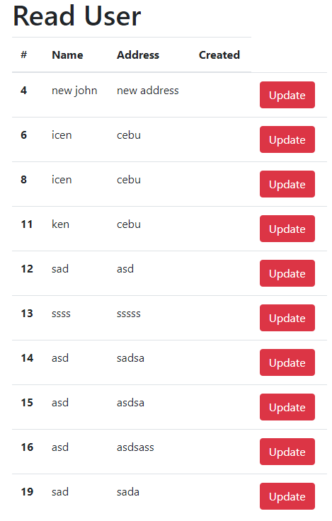

# Reactjs CRUD Axios   

# Required  
[Run this API Python Flask](https://github.com/kenntinio/pythonFlaskAPICRUD)  

# Operations  

* Create  
* Read    
* Update    
* Delete   

# Usage  
```
npm run
```
  
# UI
## Create  
   

## Read  
   

## Update  
   

## Delete  
   

You might this. You'll know when you run the app.  
[JSON Formatter](https://jsonformatter.curiousconcept.com/)  

